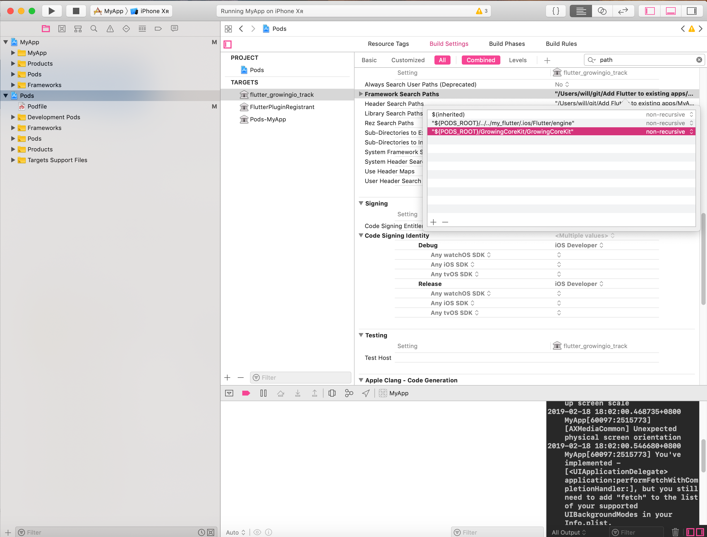

# Add-Flutter-to-existing-apps

Demo by official wiki: https://github.com/flutter/flutter/wiki/Add-Flutter-to-existing-apps
Last updated November 26, 2018.


## 注意事项：

GrowingIO SDK 集成，版本 `flutter_growingio_track: ^2.6.0`，需要手动添加 Search Path：

```
"${PODS_ROOT}/GrowingCoreKit/GrowingCoreKit"
```

